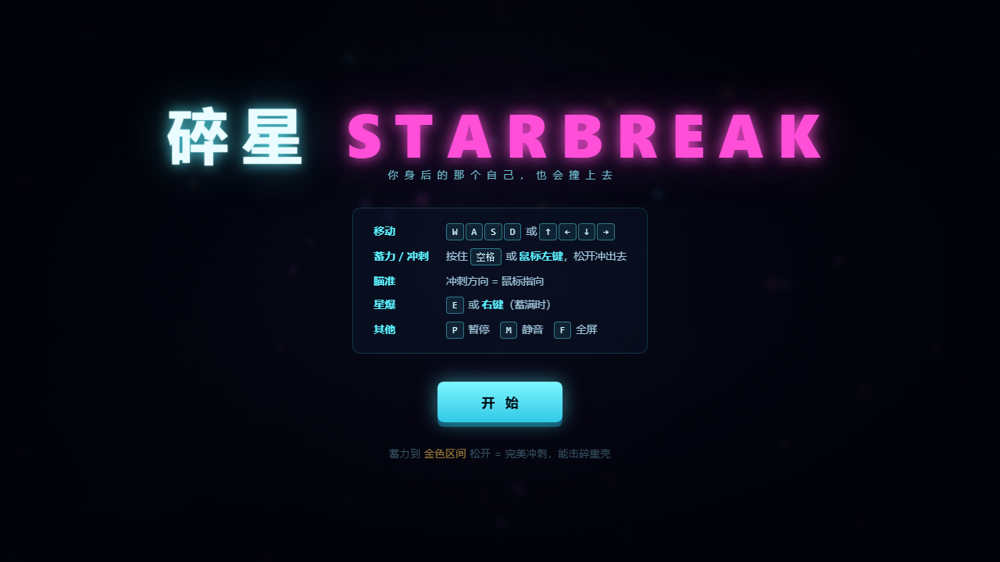

# 碎星 STARBREAK

> 一个单文件 HTML5 街机游戏。**零依赖、零素材、离线可玩。**
> 双击 `index.html` 就能玩，不需要安装任何东西，也不需要联网。



---

## 玩法

你是深空里的一颗小星核。**按住蓄力，松开冲出去把敌人撞碎。**

| 操作 | 按键 |
|---|---|
| 移动 | `W A S D` 或 `↑ ← ↓ →` |
| **蓄力 / 冲刺** | **按住 `空格` 或鼠标左键**，松开冲出去 |
| 瞄准 | **鼠标指哪冲哪** |
| 星爆（清屏大招） | `E` 或鼠标右键（需充能满、且不在冷却中） |
| 暂停 · 静音 · 全屏 | `P` · `M` · `F` |

### 三个要点

**1. 蓄力分好坏，不是越满越好。**
按住会看到一圈蓄力环。进到**金色区间**（约 62%~83%）松手是「完美冲刺」——
能破甲、能无限穿透；蓄过头反而变回普通冲刺。**贪心蓄满会吃亏。**

**2. 回声 —— 你身后的那个自己。**
每次冲刺都会在 **0.34 秒后**被重放一遍。一个延迟的你沿着同一路径再冲一次，
能替你补刀、能替你续连击、也能在你跑路时挡住追兵。

**3. 带甲的要打准。**
橙色重壳有两层甲，只有完美冲刺能破；撞不动会被弹开、还会断连击。

---

## 为什么只有一个文件

游戏里的**每一张图、每一个音效，都是代码现画 / 现算出来的**：

- **画面**：Canvas 2D 逐帧绘制。敌人是多边形路径，辉光是运行时用
  `createRadialGradient` 生成的缓存贴图（没用 `shadowBlur`，性能好得多），
  星野 / 星云 / 扫描线 / 色差全是算出来的。**一张图片素材都没有。**
- **声音**：Web Audio API 现场合成。振荡器 + 程序生成的白噪声，
  信号链 `master → makeup(×6) → limiter`（限幅器兜住团战峰值）。
  **一个音频文件都没有。**
- **字体**：用系统自带的（`Segoe UI` / `Microsoft YaHei` / `Consolas`）。

所以它天然离线、天然好传——拷到 U 盘、发到微信、丢进任何浏览器都能跑。

---

## 文件结构

```
index.html          游戏本体（单文件，全部逻辑与资源都在里面）
分享版/              可直接发给别人的干净副本 + 中文说明
screenshots/        截图
docs/               开发记录（时间线、自评）
```

`index.html` 就是全部。其余都是文档与截图。

---

## 技术细节

**渲染**
- 离屏 canvas 缓冲 + 冲击重影（chromatic aberration）
- `lighter` 混合模式做辉光；`glow()` 缓存径向渐变贴图，避免 `shadowBlur` 的性能开销
- 三层视差星野（260 颗星，各自闪烁相位）
- 顿帧（hit stop）40~90ms、屏幕震动、冲击环、粒子（火花 + 旋转碎片）

**碰撞**
- 冲刺用**扫掠检测**（`segDist2`：线段到点最短距离），而不是圆-圆判定。
  原因：冲刺最高 1940 px/s，一帧走 32 像素，掉帧时能走 80 像素，
  而最小敌人判定直径才 60 —— 纯离散步进会让玩家**直接穿过敌人**。
- 同一次冲刺用 `hitIds` 记录已命中目标，避免同一敌人在相邻帧被重复结算。

**回声机制**
- `history` 环形缓冲记录玩家轨迹（`{t, x, y, dash, perfect}`）
- `sampleHistory()` 按 `G.time - 0.34` 回溯采样，插值出延迟位置
- 回声同样走扫掠碰撞，可独立击杀

**数值**
- 所有可调参数集中在文件顶部（`CHARGE_TIME` / `SWEET_MIN` / `OVL_*` / `BOUND_*` 等）
- 星爆充能：击杀 `+0.042`、回声 `+0.058`、星尘 `+0.0022`，冷却 `3.2s`；
  **清场不回充**（否则第 3 波起就能无限连爆）

**兼容性**
- 现代浏览器（Chrome / Edge / Firefox）双击即玩
- 需要键鼠；手机浏览器能开但不好操作
- 最高分存 `localStorage`（被禁用也能正常玩，只是不记分）

---

## 开发记录

- [`docs/制作时间线.md`](docs/制作时间线.md) —— 逐条真实时间戳、各阶段占比、最大返工
- [`docs/五维自评.md`](docs/五维自评.md) —— 五维自评 + 全部实测数据 + 已知短板

两份文档里的实测数据都是脚本跑出来的，不是估计值。

---

## 已知不足

- **没有真人手感调优**：难度曲线是按设计意图定的，有 AI 机器人试玩数据（36~71 秒/局、
  打到第 3~5 波），但没有真人数据支撑。
- **音效只验证了响度、没验证好听**：用 `OfflineAudioContext` 量过（12 个音效全部出声、
  16 并发不削顶、单发峰值 +11dB 修正），但"好不好听"没法用数据证明。
- **场景单一**：只有深空一种背景，没有 Boss，没有主题变化。
- **没有内置关卡编辑器**：波次是公式生成的。

---

## 许可

**保留署名 · 禁止商用**（见 [LICENSE](LICENSE)）。

- ✅ 可以：自由使用、复制、分发、修改、二次创作
- ✅ 可以：直播、录视频、课堂演示
- ⚠️ **必须**：保留署名，公开发布时注明出处与本仓库地址
- ❌ 不可以：任何形式**商业用途**（出售、内购、广告、付费课程等）

想要商业授权，需事先联系作者。

---

*《碎星 STARBREAK》· 单文件 HTML5 · 零依赖*
